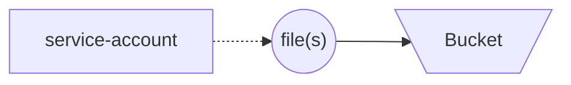

# Google Cloud (GC) Assay.Works Cloud Storage Bucket

Used for creating [Cloud Storage](https://cloud.google.com/storage/) bucket on [Google Cloud](https://cloud.google.com/) with a service account and related key to enable data or file upload and use.

This repository uses [Terraform](https://developer.hashicorp.com/terraform/intro) to maintain cloud resources. See [terraform/README.md](terraform/README.md) for documentation on Terraform elements.

## 👥 Roles

See below for an overview of roles which are important to context for various parts of this repository.

- __Terraform Administrator__: this role involves administrating over cloud resources created with Terraform. Content found under the `terraform` directory and following steps under [Tutorial: Bucket Infrastructure](#bucket-infrastructure) apply to this role.
- __Assay.Works Data Provider__: this role involves using content under `utilties` to synchronize (add, update, or remove) data to the bucket created by a Terraform Administrator. Instructions specific to this role are provided under [`utilities/README.md`](utilities/README.md).

## 🛠️ Install

See below for steps which are required for installation.

1. [Create a repository from this template](https://docs.github.com/en/repositories/creating-and-managing-repositories/creating-a-repository-from-a-template).
1. [Clone the repository](https://docs.github.com/en/repositories/creating-and-managing-repositories/cloning-a-repository) to your development environment.
1. Install [Terraform](https://developer.hashicorp.com/terraform/tutorials/aws-get-started/install-cli)
1. Configure Terraform as necessary to your Google Cloud environment.
1. __Optional__: make changes to script under `./utilities/example_gsutil_sync.sh` in preparation for synchronizing data to or from the bucket.

## :books:Tutorial

See below for brief tutorials on how to implement the work found in this repository for your needs.

### 🏗️ Bucket Infrastructure

These steps cover how to control the infrastructure found within this repository.

| :exclamation:  Please note: after applying the Terraform code with the steps below, a `service-account.json` file is added to your local directory which contains sensitive data which may enable access to your cloud resources. __This file should not be checked into source control!__   |
|-----------------------------------------|

1. Make adjustments to the content as necessary (for example, this readme file).
1. Fill in [terraform/variables.tf](terraform/variables.tf) with values that make sense for your initiative.
1. Terraform __init__: to ensure Terraform is initialized use command `terraform -chdir=terraform init`.
1. Terraform __plan__: to plan the work and observe any needs use command `terraform -chdir=terraform plan` .
1. Terraform __apply__: to apply the work and create resources use command `terraform -chdir=terraform apply`

When finished with the work, optionally use the following step.

- __OPTIONAL__: Terraform __destroy__: to destroy all created resources use command `terraform -chdir=terraform destroy`

### 📁 Using the Bucket

These steps cover an example of how to use the bucket with an example [gsutil](https://cloud.google.com/storage/docs/gsutil) script after creating the surrounding infrastructure. These steps presume `gsutil` has already been installed.

|  ⚠️  Please note: be certain data you upload to Google Cloud abide any data governance or privacy restrictions applicable to your environment. The steps below do not inherently check or validate that data, the bucket, or the Google Cloud environment follow these policies.    |
|-----------------------------------------|

1. Change directory into `./utilities`
1. Ensure `service-account.json` key is found within `./utilities` directory (becomes available after infrastructure steps are taken with Terraform).
1. Make changes to `gsutil rsync ...` line to specify the local data location and the target bucket.
1. Run the `gsutil_sync.sh` script (for example: `sh ./gsutil_sync.sh`).

## 🧑‍💻 Development

Development for this repository is assisted by the following technologies:

- [Poetry](https://python-poetry.org/docs/): Used to help configure pre-commit for local development work.
- [Pre-commit](https://pre-commit.com): Used for performing checks within local development environment and via Github Actions automated testing. The following sub-items are used as checks through [pre-commit-terraform](https://github.com/antonbabenko/pre-commit-terraform) and require local installation when testing outside of Dagger:
  - [terraform_docs](https://github.com/terraform-docs/terraform-docs/): Used to automatically generate Terraform-specific documentation.
  - [tflint](https://github.com/terraform-linters/tflint): Used to perform static analysis (linting) on Terraform content.
  - [tfsec](https://github.com/aquasecurity/tfsec): Used to perform security-focused static analysis (security linting) on Terraform content.
- [Dagger](https://docs.dagger.io/): Used to help orchestrate reproducible testing within local development environment and for automated testing.
