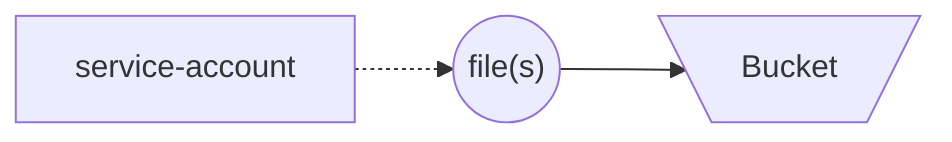

# Template: Google Cloud - Cloud Storage Bucket

Template for creating [Cloud Storage](https://cloud.google.com/storage/) bucket on [Google Cloud](https://cloud.google.com/) with a service account and related key to enable data or file upload and use.

This repository uses [Terraform](https://developer.hashicorp.com/terraform/intro) to maintain cloud resources. See [terraform/README.md](terraform/README.md) for documentation on Terraform elements.

## 🛠️ Install

See below for steps which are required for installation.

1. [Create a repository from this template](https://docs.github.com/en/repositories/creating-and-managing-repositories/creating-a-repository-from-a-template).
1. [Clone the repository](https://docs.github.com/en/repositories/creating-and-managing-repositories/cloning-a-repository)
1. Install [Terraform](https://developer.hashicorp.com/terraform/tutorials/aws-get-started/install-cli)

## :books:Tutorial

See below for a brief tutorial on how to implement the work found in this repository for your needs.

1. Make adjustments to the content as necessary (for example, this readme file).
1. Fill in [terraform/variables.tf](terraform/variables.tf) with values that make sense for your initiative.
1. Terraform __init__: to ensure Terraform is initialized use command `terraform -chdir=terraform init`.
1. Terraform __plan__: to plan the work and observe any needs use command `terraform -chdir=terraform plan` .
1. Terraform __apply__: to apply the work and create resources use command `terraform -chdir=terraform apply`

When finished with the work, optionally use the following step.

- __OPTIONAL__: Terraform destroy: : to destroy all created resources use command `terraform -chdir=terraform destroy`

## 🧑‍💻 Development

Development for this repository is assisted by the following technologies:

- [Poetry](https://python-poetry.org/docs/): Used to help configure pre-commit for local development work.
- [Pre-commit](https://pre-commit.com): Used for performing checks within local development environment and via Github Actions automated testing. The following sub-items are used as checks through [pre-commit-terraform](https://github.com/antonbabenko/pre-commit-terraform) and require local installation when testing outside of Dagger:
  - [terraform_docs](https://github.com/terraform-docs/terraform-docs/): Used to automatically generate Terraform-specific documentation.
  - [tflint](https://github.com/terraform-linters/tflint): Used to perform static analysis (linting) on Terraform content.
  - [tfsec](https://github.com/aquasecurity/tfsec): Used to perform security-focused static analysis (security linting) on Terraform content.
- [Dagger](https://docs.dagger.io/): Used to help orchestrate reproducible testing within local development environment and for automated testing.
