# Google Cloud (GC) Durbin Lab Cloud Storage Bucket

```mermaid
flowchart LR
    subgraph upload
      files[("file(s)")]
      DurbinLab["👤 Durbin Lab"]

    end
    subgraph download
      waylab["👤 Way Lab"]
      files2[("file(s)")]
    end
    bucket[\"Cloud Storage\n Bucket"/]
    files --> |to| bucket
    DurbinLab --> |uploads| files
    bucket --> |provides\naccess to| files2
    files2 --> |received by| waylab

```

Used for creating [Cloud Storage](https://cloud.google.com/storage/) bucket on [Google Cloud](https://cloud.google.com/) with a service account and related key to enable data or file upload and use.

This repository uses [Terraform](https://developer.hashicorp.com/terraform/intro) to maintain cloud resources. See [terraform/README.md](terraform/README.md) for documentation on Terraform elements.

## 👥 Roles

See below for an overview of roles which are important to context for various parts of this repository.

- __Terraform Administrator__: this role involves administrating over cloud resources created with Terraform. Content found under the `terraform` directory and following steps under [Tutorial: Bucket Infrastructure](#%EF%B8%8F-bucket-infrastructure) apply to this role.
- __Durbin Lab Data Provider__: this role involves using content under `utilties/DurbinLab` to synchronize (add, update, or remove) data to the bucket created by a Terraform Administrator. Instructions specific to this role are provided under [`utilities/DurbinLab/README.md`](utilities/DurbinLab/README.md).
- __Way Lab Data Consumer__: this role is involved with downloading content from the bucket after it has been uploaded by Durbin Lab. Associated content may be found under [`utilities/waylab/README.md`](utilities/waylab/README.md).

## 🛠️ Install

See below for steps which are required for installation.

1. [Create a repository from this template](https://docs.github.com/en/repositories/creating-and-managing-repositories/creating-a-repository-from-a-template).
1. [Clone the repository](https://docs.github.com/en/repositories/creating-and-managing-repositories/cloning-a-repository) to your development environment.
1. Install [Terraform](https://developer.hashicorp.com/terraform/tutorials/aws-get-started/install-cli)
1. Configure Terraform as necessary to your Google Cloud environment.
1. __Optional__: make changes to script under `./utilities/example_gsutil_sync.bat` in preparation for synchronizing data to or from the bucket.

## :books:Tutorial

See below for brief tutorials on how to implement the work found in this repository for your needs.

### 🎛️ State Management

These steps cover how to store [Terraform state management](https://developer.hashicorp.com/terraform/language/state) files in association with the bucket infrastructure below. Terraform tracks cloud resources it creates as a statefile (`.tfstate`). If multiple people want to manage the same resources at the same time, they all need to have access to the same statefile or else they overwriting or corrupting state data. One option for sharing this statefile is to use a Google Cloud Bucket, which is the option used here.

Note: Terraform cloud state management must be setup before it is referenced as a backend.

1. Make adjustments to the content as necessary (for example, this readme file).
1. Fill in [terraform/state-management/variables.tf](terraform/variables.tf) with values that make sense for your initiative.
1. Terraform __init__: to ensure Terraform is initialized use command `terraform -chdir=terraform/state-management init`.
1. Terraform __plan__: to plan the work and observe any needs use command `terraform -chdir=terraform/state-management plan` .
1. Terraform __apply__: to apply the work and create resources use command `terraform -chdir=terraform/state-management apply`

### 🏗️ Bucket Infrastructure

These steps cover how to control the infrastructure found within this repository.

| :exclamation:  Please note: after applying the Terraform code with the steps below, a `service-account.json` file is added to your local directory which contains sensitive data which may enable access to your cloud resources. __This file should not be checked into source control!__   |
|-----------------------------------------|

1. Make adjustments to the content as necessary (for example, this readme file).
1. Fill in [terraform/operations/variables.tf](terraform/variables.tf) with values that make sense for your initiative.
1. Terraform __init__: to ensure Terraform is initialized use command `terraform -chdir=terraform/operations init`.
1. Terraform __plan__: to plan the work and observe any needs use command `terraform -chdir=terraform/operations plan` .
1. Terraform __apply__: to apply the work and create resources use command `terraform -chdir=terraform/operations apply`

When finished with the work, optionally use the following step.

- __OPTIONAL__: Terraform __destroy__: to destroy all created resources use command `terraform -chdir=terraform/operations destroy`

### 📁 Using the Bucket

These steps cover an example of how to use the bucket after creating the surrounding infrastructure.

|  ⚠️  Please note: be certain data you upload to Google Cloud abide any data governance or privacy restrictions applicable to your environment. The steps below do not inherently check or validate that data, the bucket, or the Google Cloud environment follow these policies.    |
|-----------------------------------------|

- Data Upload (Durbin Lab): please see [`utilities/DurbinLab/README.md`](utilities/DurbinLab/README.md) for more information.
- Data Download (Way Lab): please see [`utilities/waylab/README.md`](utilities/waylab/README.md) for more information.

## 🧑‍💻 Development

Development for this repository is assisted by the following technologies:

- [Poetry](https://python-poetry.org/docs/): Used to help configure pre-commit for local development work.
- [Pre-commit](https://pre-commit.com): Used for performing checks within local development environment and via Github Actions automated testing. The following sub-items are used as checks through [pre-commit-terraform](https://github.com/antonbabenko/pre-commit-terraform) and require local installation when testing outside of Dagger:
  - [terraform_docs](https://github.com/terraform-docs/terraform-docs/): Used to automatically generate Terraform-specific documentation.
  - [tflint](https://github.com/terraform-linters/tflint): Used to perform static analysis (linting) on Terraform content.
  - [tfsec](https://github.com/aquasecurity/tfsec): Used to perform security-focused static analysis (security linting) on Terraform content.
- [Dagger](https://docs.dagger.io/): Used to help orchestrate reproducible testing within local development environment and for automated testing.
